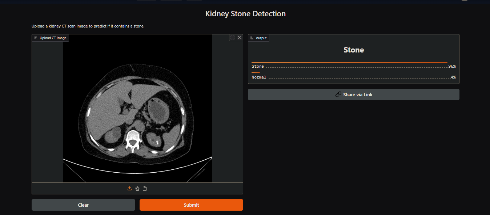
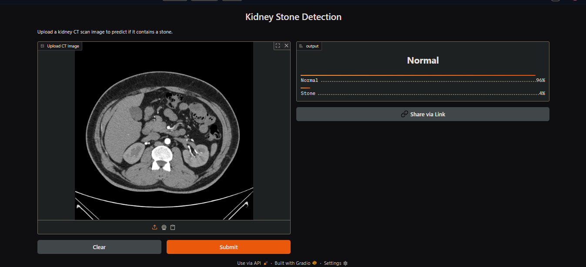

# 🧠 Kidney Stone Detection using CNN (TensorFlow)

This project uses a Convolutional Neural Network to detect kidney stones in CT scan images. Built using TensorFlow and deployed using Gradio.

## 🔍 Features
- Image preprocessing and augmentation
- CNN with BatchNorm, Dropout, Adam optimizer
- Class imbalance handling with computed weights
- Gradio Web UI for predictions

## 🚀 Try it Online
[Click here to open the demo](https://huggingface.co/spaces/itsharpal/kidney-stone-detection)

## 🗂️ Files
- `app.py` – Gradio interface
- `MV_OEP_final.ipynb` – Original training notebook
- `kidney_stone_detection_model_final.keras` – Trained model
- `requirements.txt` – Dependencies

## 📸 Screenshot
- Stone Image :

- Normal Kidney Image :

---

### 👨‍💻 Author
- Harpal Chapatwala
